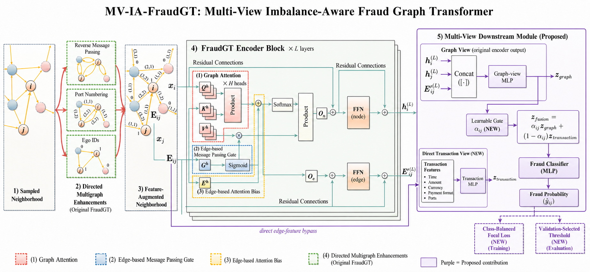

# MV-IA-FraudGT

**Multi-View Imbalance-Aware Fraud Graph Transformer** is an experimental
extension of [FraudGT](https://github.com/junhongmit/FraudGT) for highly
imbalanced anti-money-laundering edge classification.



## What changed

The upstream FraudGT encoder is kept intact: neighbor sampling, reverse
message passing, port numbering, Ego IDs, graph attention, edge message gate,
edge attention bias, residual connections, and node/edge FFNs.

This repository adds three isolated components:

1. **Multi-view gated edge head**
   (`fraudGT/head/multiview_hetero_edge.py`)
   - Graph view: final source node, target node, and edge embeddings.
   - Transaction view: a direct bypass of normalized input edge features.
   - A learned per-transaction scalar gate fuses the two views.
2. **Class-weighted focal loss**
   (`fraudGT/loss/class_weighted_focal.py`)
   - Uses configurable class weights and focal focusing parameter `gamma`.
3. **Leakage-safe threshold selection**
   (`fraudGT/evaluation/threshold_selection.py`)
   - Selects the operating threshold on validation F1 only.

See [NOTICE.md](NOTICE.md) for upstream attribution and redistribution notes.

## Architecture

For transaction `(i, j)`:

```text
z_graph = MLP([h_i^L || h_j^L || E_ij^L])
z_transaction = MLP(E_ij_input)
alpha = sigmoid(MLP([z_graph || z_transaction]))
z_fusion = alpha * z_graph + (1 - alpha) * z_transaction
prediction = Classifier(z_fusion)
```

The head stores the most recent gate values in `model.post_gt.last_gate` for
diagnostics.  Values close to one favour graph context; values close to zero
favour direct transaction attributes.

## Reproducible configurations

Three resource-matched T4 configs are included:

| Config | Head | Loss | Purpose |
|---|---|---|---|
| `AML-Small-HI-FullMultiFraudGT-T4.yaml` | Original edge head | weighted CE | Baseline A |
| `AML-Small-HI-MV-FraudGT-T4.yaml` | Multi-view | weighted CE | Head ablation |
| `AML-Small-HI-MV-IA-FraudGT-T4.yaml` | Multi-view | focal | Proposed model |

Both use batch 256, fanout `[15, 15]`, 128 iterations/epoch, 50 epochs, and
the full FraudGT encoder.  Compare them with the resource-matched upstream
Multi-FraudGT baseline; do not compare these numbers directly with the paper's
V100/500-epoch result.

## Setup

```bash
conda create -n mvia-fraudgt python=3.9 -y
conda activate mvia-fraudgt
conda install pytorch torchvision torchaudio pytorch-cuda=11.8 -c pytorch -c nvidia
conda install pyg -c pyg
pip install -r requirements.txt
```

Place `HI-Small_Trans.csv` under the data directory expected by the config,
then run:

```bash
python -m fraudGT.main \
  --cfg configs/AML-Small-HI/AML-Small-HI-MV-IA-FraudGT-T4.yaml \
  --repeat 1 \
  --gpu 0 \
  name_tag MV-IA-FraudGT
```

For a fair one-seed Kaggle comparison, run these notebooks separately and in
order:

1. `notebooks/kaggle/02_A_FullMultiFraudGT_T4.ipynb` — original head +
   weighted cross-entropy.
2. `notebooks/kaggle/03_B_MV_FraudGT_T4.ipynb` — multi-view head + weighted
   cross-entropy.
3. `notebooks/kaggle/04_C_MV_IA_FraudGT_T4.ipynb` — multi-view head +
   class-weighted focal loss.

All three use seed 42 and the same T4 resource budget. Each notebook selects
the epoch and threshold using validation F1 and then reports the matching test
metrics.

## Evaluation protocol

1. Train with seeds 42, 43, and 44.
2. Select the best epoch using validation F1.
3. Select the threshold using validation predictions only.
4. Apply that fixed epoch and threshold to the test split.
5. Report precision, recall, F1, ROC-AUC, time, and memory as mean +/- std.

After a multi-seed run, summarize with:

```bash
python scripts/summarize_thresholds.py results/<experiment-directory>
```

## Status

This is research prototype code.  Start with one-seed smoke tests before
running the full three-seed experiment.
